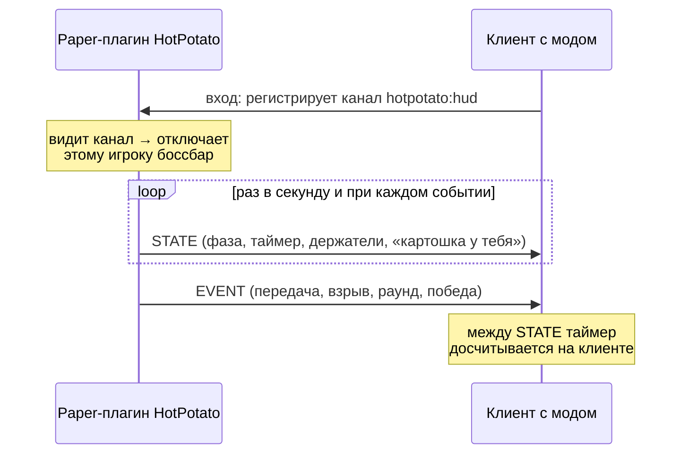

# HotPotato HUD

[](https://github.com/TTcux1/HotPotato-HUD/actions/workflows/build.yml)

Клиентский мод на **Fabric 1.21.4** (Kotlin) для мини-игры [HotPotato](https://github.com/TTcux1/HotPotato). Сервер — обычный Paper-плагин, мод получает от него данные игры через собственный канал и рисует интерфейс, которого нет в ванильном клиенте.

## Что показывает

```
              ┌──────── Раунд 3 · живых 5/8 ────────┐
              │                 17                   │      Картошка у:
              │ ████████████████░░░░░░░░░░░░░░░░░░░░ │      Steve, Alex
              └──────────────────────────────────────┘      КЛАТЧ! Steve → Alex
                    У ТЕБЯ КАРТОШКА! Передай ударом          Бум! Notch
```

- **Таймер и полоса фитиля** плавно идут на любом FPS. Цвет меняется от зелёного к красному, в последние секунды полоса мигает.
- **Предупреждение держателю:** пульсирующая красная рамка по краям экрана, к концу фитиля пульсирует быстрее.
- **Кто держит картошку** и **лента событий:** передачи, клатчи, взрывы. Записи плавно гаснут.
- **Баннеры** начала раунда и победы с плавным появлением.

Игроки без мода продолжают видеть обычный боссбар: сервер сам определяет, у кого стоит мод.

## Как устроено



```
src/main/kotlin/dev/hotpotato/hud/
├── protocol/HudProtocol   бинарный протокол v1, не зависит от Minecraft
├── state/HudController    состояние HUD, таймер, лента событий, анимации
└── client/                Fabric: приём пакетов, отрисовка, точка входа
```

Ключевые решения:

- **Протокол отделён от Minecraft.** Бинарный формат с номером версии описан в `HudProtocol`. Неизвестные версии и типы сообщений мод молча пропускает, поэтому сервер можно обновлять раньше клиентов. Повреждённые данные и аномальные списки имён отклоняются, а не роняют клиент.
- **Совместимость с сервером проверяется тестами.** Тот же формат реализован в плагине HotPotato (`HudWire`). Оба репозитория проверяют кодирование на одинаковых эталонных байтах: если формат разойдётся с одной стороны, тест упадёт.
- **Минимум трафика, плавная картинка.** Сервер шлёт состояние раз в секунду, клиент между пакетами сам уменьшает таймер. Небольшие задержки пакета не заставляют таймер прыгать назад.
- **Логика без Minecraft.** `HudController` управляется вызовами `tick()`, поэтому таймер, анимации и лента событий покрыты обычными юнит-тестами. Рендерер только рисует.
- **Канал = признак установленного мода.** Регистрация приёмника сама сообщает серверу, что мод есть. Отдельное «рукопожатие» не нужно.

## Установка

1. Fabric Loader для Minecraft 1.21.4.
2. В `mods/`: [Fabric API](https://modrinth.com/mod/fabric-api), [Fabric Language Kotlin](https://modrinth.com/mod/fabric-language-kotlin) и `hotpotato-hud-x.y.z.jar` (артефакт сборки в Actions).
3. Зайдите на сервер с плагином [HotPotato](https://github.com/TTcux1/HotPotato) версии с поддержкой HUD.

## Сборка

```bash
./gradlew build
```

Jar появится в `build/libs/`. Тесты протокола и логики HUD запускаются при сборке и в GitHub Actions.

## Лицензия

[MIT](LICENSE)
